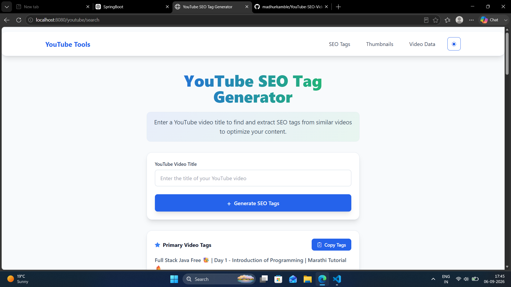
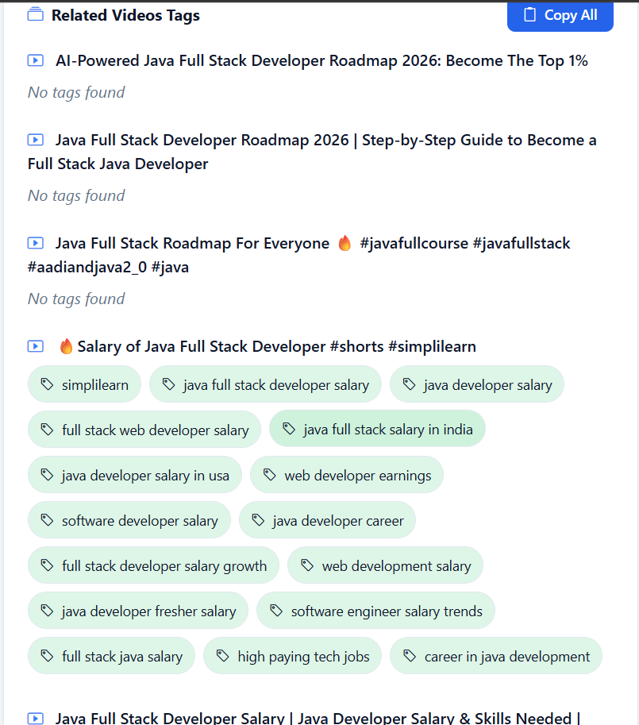
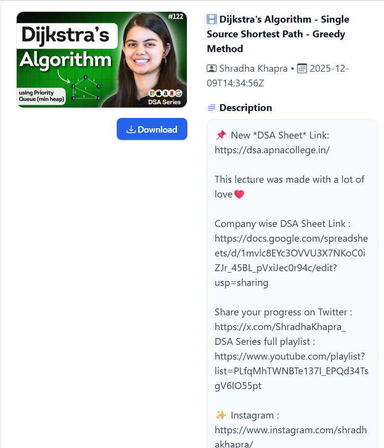
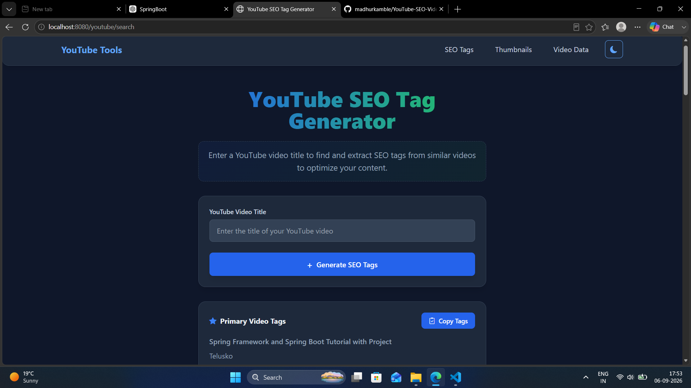

Yes. According to your screenshot, the **exact screenshot filenames** are:

* `Home_SC.png`
* `SEO_Tags_1.png`
* `SEO_Tags_2.png`
* `Thumbnail_Downloader.png`
* `YT_Video_Data_Retriever.png`
* `Dark_Theme.png`

Here is the **complete updated README.md** using those exact names and your actual GitHub/LinkedIn links:

````markdown
# 🎬 YouTube Tools

A **Spring Boot-based web application** that provides useful tools for YouTube creators, including **SEO tag generation, thumbnail downloading, and video data retrieval**.

---

## 🚀 Features

### 🔍 YouTube SEO Tag Generator

- Enter a YouTube video title.
- Search for related YouTube videos.
- Extract SEO tags from similar videos.
- Display tags from the primary and related videos.
- Copy individual tags or all tags to the clipboard.

### 🖼️ YouTube Thumbnail Downloader

- Enter a YouTube video URL or video ID.
- Automatically extract the video ID.
- Fetch and preview the video thumbnail.
- Download the thumbnail as an image.

### 📊 YouTube Video Data Retriever

- Enter a YouTube video URL or ID.
- Retrieve complete video information including:
  - Video title
  - Channel name
  - Published date
  - Description
  - Tags
  - Thumbnail
- Preview the thumbnail.
- Download the thumbnail.

### 🌙 Light & Dark Mode

- Light mode and dark mode.
- Theme preference is saved using browser `localStorage`.
- Consistent **Blue + Green + Slate** color combination.
- Responsive user interface.

---

## 🛠️ Technologies Used

- **Java 21**
- **Spring Boot**
- **Spring MVC**
- **Spring WebFlux / WebClient**
- **Thymeleaf**
- **Tailwind CSS**
- **Bootstrap Icons**
- **Lombok**
- **YouTube Data API v3**
- **Maven**

---

## 📁 Project Structure

```text
YoutubeTools
│
├── src
│   └── main
│       ├── java
│       │   └── com.YoutubeTools
│       │       ├── Config
│       │       │   └── WebClientConfig.java
│       │       │
│       │       ├── Controller
│       │       │   ├── PageController.java
│       │       │   ├── ThumbnailController.java
│       │       │   ├── YoutubeTagsController.java
│       │       │   └── YoutubeVideoController.java
│       │       │
│       │       ├── Model
│       │       │   ├── SearchVideo.java
│       │       │   ├── Video.java
│       │       │   └── VideoDetails.java
│       │       │
│       │       ├── Service
│       │       │   ├── ThumbnailService.java
│       │       │   └── YoutubeService.java
│       │       │
│       │       └── YoutubeToolsApplication.java
│       │
│       └── resources
│           ├── static
│           ├── templates
│           │   ├── fragments
│           │   │   └── navbar.html
│           │   ├── home.html
│           │   ├── thumbnails.html
│           │   └── video-details.html
│           │
│           └── application.properties
│
├── OUTPUT_SS
│   ├── Home_SC.png
│   ├── SEO_Tags_1.png
│   ├── SEO_Tags_2.png
│   ├── Thumbnail_Downloader.png
│   ├── YT_Video_Data_Retriever.png
│   └── Dark_Theme.png
│
├── pom.xml
└── README.md
````

---

## 📸 Screenshots

### 🏠 Home Page



---

### 🔍 SEO Tags Generator




---

### 🖼️ Thumbnail Downloader


---

### 📊 YouTube Video Data Retriever



---

### 🌙 Dark Theme



---

## ⚙️ Installation & Setup

### 1. Clone the Repository

```bash
git clone https://github.com/madhurkamble/YouTube-SEO-Video-Utility-Web-App.git
```

```bash
cd YouTube-SEO-Video-Utility-Web-App
```

### 2. Configure YouTube API

Create a **YouTube Data API v3** API key through Google Cloud.

Add the following configuration to `application.properties`:

```properties
youtube.api.key=YOUR_YOUTUBE_API_KEY
youtube.api.base.url=https://www.googleapis.com/youtube/v3
youtube.api.max.related.videos=10
```

> ⚠️ **Important:** Never commit your actual API key to GitHub. Use environment variables or an untracked configuration file for sensitive credentials.

### 3. Run the Application

Using Maven:

```bash
mvn spring-boot:run
```

Or run:

```text
YoutubeToolsApplication.java
```

from your IDE.

The application will be available at:

```text
http://localhost:8080
```

---

## 🔗 Application Pages

| Feature                  | URL              |
| ------------------------ | ---------------- |
| 🔍 SEO Tag Generator     | `/`              |
| 🖼️ Thumbnail Downloader | `/thumbnail`     |
| 📊 Video Data Retriever  | `/video-details` |

---

## 🔑 YouTube Data API

The application uses **YouTube Data API v3** to retrieve YouTube information.

The API is used for:

* Searching YouTube videos
* Retrieving video metadata
* Retrieving video tags
* Retrieving thumbnails

---

## 🎨 UI Design

The application uses a consistent:

**🔵 Blue + 🟢 Green + ⚪ Slate**

color combination.

### Light Mode

* Slate background
* White cards
* Blue primary buttons
* Green tag accents
* Blue-to-green gradient headings

### Dark Mode

* Dark slate background
* Dark slate cards
* Blue primary buttons
* Green tag accents
* Blue-to-green gradient headings

---

## 📋 Main Functional Flow

```text
User
 │
 ├── SEO Tag Generator
 │       ↓
 │   Enter Video Title
 │       ↓
 │   YouTube API Search
 │       ↓
 │   Find Related Videos
 │       ↓
 │   Extract Tags
 │       ↓
 │   Display / Copy Tags
 │
 ├── Thumbnail Downloader
 │       ↓
 │   Enter URL / Video ID
 │       ↓
 │   Extract Video ID
 │       ↓
 │   Fetch Thumbnail
 │       ↓
 │   Preview / Download
 │
 └── Video Data Retriever
         ↓
     Enter URL / Video ID
         ↓
     Extract Video ID
         ↓
     YouTube API
         ↓
     Retrieve Video Details
         ↓
     Display Information
```

---

## 🔮 Future Improvements

* 📈 YouTube video statistics
* 👁️ View count analysis
* 👍 Like and comment statistics
* 🔑 Keyword difficulty analysis
* 📊 SEO score calculation
* 🏷️ Bulk tag generation
* 📋 Search history
* 📱 Improved mobile interface
* 👤 User authentication
* 📊 YouTube analytics dashboard
* 🖼️ Support for additional thumbnail resolutions

---

## 🔗 Links

### 🐙 GitHub Repository

[https://github.com/madhurkamble/YouTube-SEO-Video-Utility-Web-App.git](https://github.com/madhurkamble/YouTube-SEO-Video-Utility-Web-App.git)

### 🐙 GitHub Profile

[https://github.com/madhurkamble](https://github.com/madhurkamble)

### 💼 LinkedIn

[https://linkedin.com/in/madhur-kamble-55911b290](https://linkedin.com/in/madhur-kamble-55911b290)

---

## 👨‍💻 Author

### Madhur Kamble

Computer Engineering Student & Developer

* 🐙 GitHub: [https://github.com/madhurkamble](https://github.com/madhurkamble)
* 💼 LinkedIn: [https://linkedin.com/in/madhur-kamble-55911b290](https://linkedin.com/in/madhur-kamble-55911b290)

---

## 📄 License

This project is created for **educational and development purposes**.
